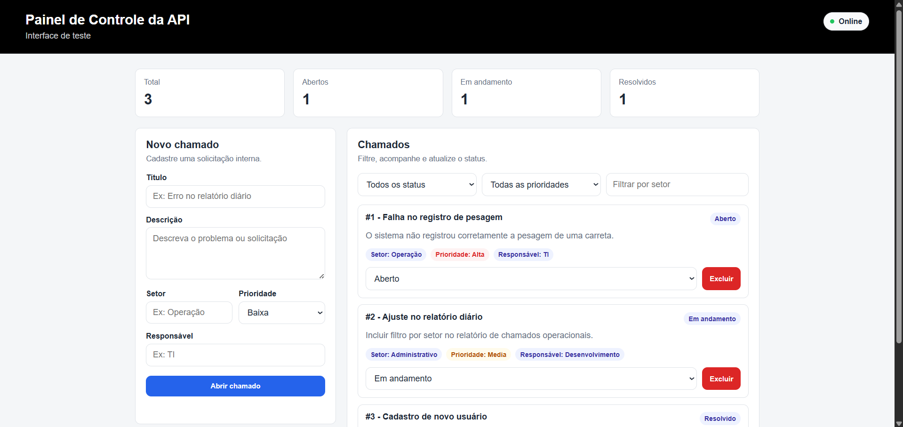

# InternalTicketsAPI

API para controle de chamados internos entre setores, desenvolvida com Node.js e Express.

O projeto simula um fluxo simples de abertura, listagem, filtro e atualização de chamados, com uma interface web para testar o consumo da API.

## Demonstração



## Objetivo

O objetivo do projeto é representar um cenário comum em sistemas internos: registrar demandas entre setores, acompanhar prioridades e atualizar o status de cada chamado.

## Tecnologias utilizadas

- Node.js
- Express
- JavaScript
- HTML
- CSS
- API REST
- Git e GitHub

## Funcionalidades

- Cadastro de chamados internos
- Listagem de chamados
- Busca de chamado por ID
- Filtro por status, prioridade e setor
- Atualização de status
- Exclusão de chamados
- Interface web simples para testar a API
- Validação básica dos dados enviados

## Regras aplicadas

- Título, descrição, setor e prioridade são obrigatórios.
- Todo chamado novo começa com status `Aberto`.
- As prioridades aceitas são: `Baixa`, `Media`, `Alta` e `Critica`.
- Os status aceitos são: `Aberto`, `Em andamento`, `Resolvido` e `Cancelado`.
- Ao alterar o status, a data de atualização do chamado também é atualizada.

## Estrutura do projeto

```text
InternalTicketsAPI/
│
├── public/
│   ├── index.html
│   ├── styles.css
│   └── app.js
│
├── src/
│   ├── controllers/
│   │   └── ticketsController.js
│   ├── data/
│   │   └── ticketsStore.js
│   ├── routes/
│   │   └── ticketsRoutes.js
│   ├── services/
│   │   └── ticketsService.js
│   ├── utils/
│   │   └── text.js
│   └── server.js
│
├── .env.example
├── .gitignore
├── package.json
└── README.md
```

## Endpoints

### Status da API

GET /api/health

### Listar chamados

GET /api/tickets

Filtros opcionais:

GET /api/tickets?status=Aberto
GET /api/tickets?prioridade=Alta
GET /api/tickets?setor=Operação

### Buscar chamado por ID

GET /api/tickets/1

### Criar chamado

POST /api/tickets

Exemplo:

{
  "titulo": "Erro no registro de pesagem",
  "descricao": "O sistema não registrou corretamente a pesagem de uma carreta.",
  "setor": "Operação",
  "prioridade": "Alta",
  "responsavel": "TI"
}

### Atualizar status

PATCH /api/tickets/1/status

Exemplo:

{
  "status": "Em andamento"
}

### Excluir chamado

DELETE /api/tickets/1

## Como executar

Instale as dependências:

npm install

Execute o projeto:

npm run dev

Ou:

npm start

Acesse no navegador:

http://localhost:3000

A API ficará disponível em:

http://localhost:3000/api/tickets

## Conceitos aplicados

- Criação de API REST com Node.js e Express
- Separação entre rotas, controllers e services
- Validação de dados
- Organização de código em camadas
- Manipulação de dados em memória
- Consumo de API com JavaScript
- Interface simples integrada ao back-end
- Filtros por query string

## Melhorias futuras

- Persistência com banco de dados
- Autenticação de usuários
- Histórico de movimentações por chamado
- Dashboard com gráficos
- Testes automatizados
- Migração para TypeScript